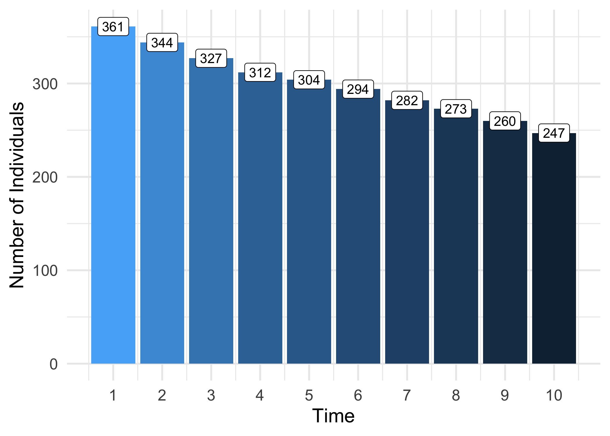

<!-- README.md is generated from README.Rmd. Please edit that file -->

<!-- badges: start -->


[](https://www.gnu.org/licenses/gpl-3.0)
[](https://travis-ci.org/dymium-org/dymiumCore)
[](https://ci.appveyor.com/project/asiripanich/dymiumcore/branch/master)
[](https://codecov.io/gh/dymium-org/dymiumCore?branch=master)
[](https://www.tidyverse.org/lifecycle/#maturing)
<!-- [](https://CRAN.R-project.org/package=dymiumCore) -->
<!-- badges: end -->

# dymiumCore


**dymiumCore** is an R package which provides a toolbox for developing a
microsimulation model. While the core focus of the package is for
modelling urban systems, dymium can be easily extended to apply in other
contexts as well.

**:newspaper: News**

  - :tada: [dymiumCore
    version 0.1.6.](https://blog.amarin.dev/posts/dymiumcore-version-0-1-6-release/)

# Why another microsimulation framework?

It is true that there is no shortage of open source microsimulation
frameworks, but many of the existing ones often use a platform that
doesn’t support data analysis as good as R, or use a programming
langauge that many modellers may be unfamiliar with. Hence, those
frameworks would not be the first choice for many modellers who are
interested in microsimulation modelling but lack the programming skills
or time to learn a programming langauge that is foreign and has no other
benefits to them. The main philosophy of `dymiumCore` is to use the
power of existing R packages to create functions and classes that are
the basic building blocks of any microsimulation model, in general, and
to allow an entire workflow from data preparation, model estimation,
microsimulation, calibration to visualisation within only the R
environment, where many other frameworks do not offer. This enhances
reproducibility and maintainability of your microsimulation model and
allow others to build on your work more easily. [Read
more…](https://core.dymium.org/articles/why-another-microsim.html)

# Why `dymiumCore`?

  - written in R
  - easy to setup
  - ready-to-use events see
    [dymium-org/dymiumModules](https://github.com/dymium-org/dymiumModules)
  - microsimulation events are modular, sharable and scalable
  - equipped with the basic building blocks for building a
    microsimulation model that is flexible and extensible.
  - can use parameters from various model objects (e.g. `stats::lm`,
    `stats::glm`, `caret::train`, `mlr::train`).

## Installation

You can install the released version of dymiumCore from Github with:

``` r
remotes::install_github("dymium-org/dymiumCore", 
                         ref = remotes::github_release())
```

The current development version on Github can be installed with:

``` r
remotes::install_github("dymium-org/dymiumCore")
```

Note that, `dymiumCore` is not yet on CRAN.

## A Hello World Example\!

This is a minimal example of how one can create a discrete-time
microsimulation model with dymiumCore.

In this example, we have three events: ageing, giving birth, and dying.
The ageing event increases age of all individuals by 1 year in each
iteration, as control by the for loop. The giving birth event only
changes the ‘give\_birth’ variable of eligible female individuals (age
between 18 to 50) to ‘yes’ if the transition for an individual is
successful. Note that this simple example doesn’t add newborns from the
birth event to the population, however, it can be done easily using
`Individual$add()`. The dead event changes the age attribute of dying
individuals to ‘-1’, which means once an individual is dead it will not
be considered in any transition or mutate\_entity statement, as we apply
`not_dead_filter` and a subset statement to them.

The first principle of dymiumCore is to keep all `Entity` objects and
models (optionally) inside a `World` object. This allows us to construct
a microsimulation model as a data analysis pipeline, which you will see
below.

``` r
library(dymiumCore)
library(data.table)

# create simple models
birth_model <- list(yes = 0.1, no = 0.9)
death_model <- list(yes = 0.1, no = 0.9)

# prepare population data
ind_data <- 
  data.table::copy(toy_individuals) %>%
  .[, give_birth := "no"]

# create a World object, a container for all entities and models for simulation
world <- World$new()
world$add(x = Individual$new(.data = ind_data, id_col = "pid"))

# create filters, this is a method for creating functions using `magrittr` and
# data.table's syntax
filter_eligible_females <- 
  . %>%
  .[sex == "female" & age %between% c(18, 50)]

filter_alive <- 
  . %>%
  .[age != -1]

# create a pipeline of transition events
for (year in 1:10) {
  world %>%
    mutate_entity(entity = "Individual", 
                  age := age + 1L, 
                  subset = age != -1L) %>%
    transition(entity = "Individual", 
               model = birth_model, 
               attr = "give_birth", 
               preprocessing_fn = . %>% filter_eligible_females %>% filter_alive) %>%
    transition(entity = "Individual", 
               model = death_model, 
               attr = "age", 
               values = c(yes = -1L), 
               preprocessing_fn = filter_alive) %>%
    add_log(time = year, 
            desc = "count:Individual", 
            value = .$entities$Individual$get_data()[age != -1L, .N])
}
```

> Note that, the line `value = .$entities$Individual$get_data()[age !=
> -1L, .N]` is using the world object’s placeholder which is called `.`
> for extracting the attribute data of individual agents. This is a
> feature of `magrittr`, to learn more about various ways that `%>%` can
> be used see [its documentation page](https://magrittr.tidyverse.org/).

To get the attribute data of any `Entity` object use `$get_data()`
method.

``` r
world$entities$Individual$get_data()
#>      pid hid age    sex marital_status partner_id father_id mother_id
#>   1:   1   1  -1   male  never married         NA        NA        NA
#>   2:   2   2  -1 female  never married         NA        NA        NA
#>   3:   3   2  -1 female  never married         NA        NA        NA
#>   4:   4   3  -1   male        married          5        NA        NA
#>   5:   5   3  -1 female        married          4        NA        NA
#>  ---                                                                 
#> 369: 369 143  83   male        married        368        NA        NA
#> 370: 370 144  59 female        married        371        NA        NA
#> 371: 371 144  -1   male        married        370        NA        NA
#> 372: 372 144  -1   male  never married         NA       371       370
#> 373: 373 144  -1   male  never married         NA       371       370
#>      give_birth
#>   1:         no
#>   2:         no
#>   3:         no
#>   4:         no
#>   5:         no
#>  ---           
#> 369:         no
#> 370:         no
#> 371:         no
#> 372:         no
#> 373:         no
```

The `add_log()` function allows any object to be stored in our World
object for doing post-simulation analysis. In the example, we logged the
number of individuals that were alive in each simulation year. We can
extract the log data using `get_log()`. The `value` column of the log
data by `get_log()` is a list column, this is to allow any object to be
stored in `value`, so we must flatten in to integer to make the log data
easier to work with.

``` r
# get log data
log_data <- 
  get_log(world) %>% 
  .[, value := unlist(value)]
print(log_data)
#>     time created_timestamp class  tag             desc value
#>  1:    1        1585760565 World <NA> count:Individual   332
#>  2:    2        1585760565 World <NA> count:Individual   296
#>  3:    3        1585760565 World <NA> count:Individual   264
#>  4:    4        1585760565 World <NA> count:Individual   241
#>  5:    5        1585760565 World <NA> count:Individual   209
#>  6:    6        1585760565 World <NA> count:Individual   191
#>  7:    7        1585760565 World <NA> count:Individual   169
#>  8:    8        1585760565 World <NA> count:Individual   151
#>  9:    9        1585760565 World <NA> count:Individual   139
#> 10:   10        1585760565 World <NA> count:Individual   126
```

Let’s visualise how many individual agents are still alive at the end of
the simulation.

``` r
library(ggplot2)
ggplot(data = log_data) +
  geom_col(aes(x = time, y = value, fill = value)) +
  labs(x = "Time", y = "Number of Individuals") +
  scale_x_continuous(n.breaks = 10) +
  guides(fill = "none") +
  theme_minimal(base_size = 16)
```



This is just an introductory example of dymiumCore, the real power of
the package is in the building blocks and functions that allow you to
create a large-scale microsimulation model that is easily maintainable
and scalable model by breaking down each complex component into an event
function as illustrated in
[dymium-org/dymiumExampleProject](https://github.com/dymium-org/dymiumExampleProject).

## Documentation and Tutorials

For documentation and tutorials, please check our website at
<https://core.dymium.org>.

## Available modules

Please visit
[dymium-org/dymiumModules](https://github.com/dymium-org/dymiumModules)
to see the available modules.

## Try `dymiumCore` with an example project

Please visit
[dymium-org/dymiumExampleProject](https://github.com/dymium-org/dymiumExampleProject)
to learn more about this.

## Collaboration

We are open to collaboration on this project. If you are interested,
please email us at amarin at dymium.org.

## Development plan (as of 14th March 2020)

  - [x] **Version 0.1.0**: (21 Jan 2020) Release all the basic building
    blocks for microsimulation modelling.
      - [x] **Version 0.1.6**: Support `mlr` in `transision()` and
        `TransitionClassification`.
      - [ ] Support regression model creation from parameters.
      - [ ] Support `mlr3` and `mlogit` model objects in the Transition
        classes.
  - [ ] **Version 0.2.0**: Implement model-based calibration.
  - [ ] **Version 0.3.0**: Visualisation functions for life-courses,
    spatial data, etc.
  - [ ] **Version 0.4.0**: Integration with dymiumGUI.

## Related open-source frameworks and models

**General-purpose microsimulation frameworks**

  - [LIAM2, Python](https://github.com/liam2/liam2)
  - [JASMINE, Java](http://www.jas-mine.net/)
  - [MicSim,
    R](https://cran.r-project.org/web/packages/MicSim/index.html)
  - [neworder, Python](https://github.com/virgesmith/neworder)
  - [simarioV2, R](https://github.com/kcha193/simarioV2)
  - [JAMSIM, Java](https://github.com/compassresearchcentre/jamsim)

**Multi-agent programmable modeling environment**

  - [NetLogo](https://ccl.northwestern.edu/netlogo/)

**Urban microsimulation land-use models**

  - [UrbanSim, Python](https://github.com/UDST/urbansim)
  - [ILUTE, C\#](https://github.com/TravelModellingGroup/ILUTE)
  - [SILO, Java](https://github.com/msmobility/silo)

## Recommended scholarly articles

To learn more about dynamic microsimulation modelling and some of its
use cases please see these articles.

  - O’Donoghue, C. (2001). Dynamic microsimulation: a methodological
    survey. Brazilian Electronic Journal of Economics, 4(2), 77.
  - Li, J., & O’Donoghue, C. (2013). A survey of dynamic microsimulation
    models: uses, model structure and methodology. International Journal
    of microsimulation, 6(2), 3-55.
  - Rutter, C. M., Zaslavsky, A. M., & Feuer, E. J. (2011). Dynamic
    microsimulation models for health outcomes: a review. Medical
    Decision Making, 31(1), 10-18.
  - GouuAs, K. G., & Kitamura, R. (1992). Travel demand forecasting with
    dynamic microsimulation.
