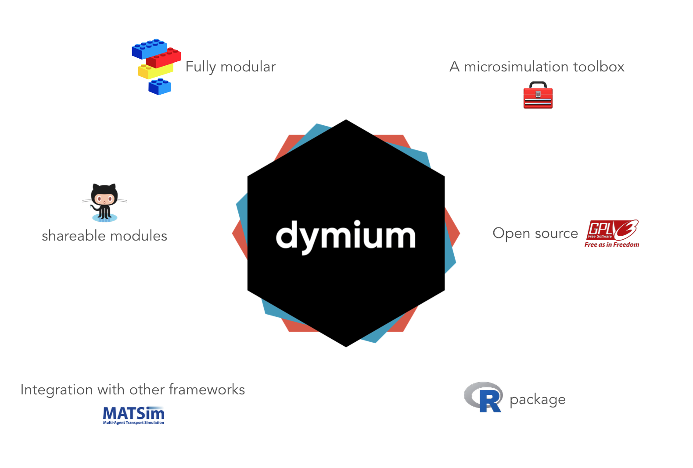

<!-- README.md is generated from README.Rmd. Please edit that file -->

```{r setup, include = FALSE}
library(dymiumCore)
knitr::opts_chunk$set(
  collapse = TRUE,
  comment = "#>",
  fig.path = "man/figures/README-",
  out.width = "100%",
  message = FALSE
)
knitr::opts_chunk$set(dpi = 300, fig.width = 7)
set.seed(728)
```
<!-- badges: start -->

[](https://github.com/dymium-org/core/actions)
[](https://www.gnu.org/licenses/gpl-3.0)
[](https://codecov.io/gh/dymium-org/dymiumCore?branch=master)
[](https://www.tidyverse.org/lifecycle/#maturing)
<!-- [](https://CRAN.R-project.org/package=dymiumCore) -->
<!-- badges: end -->

# dymiumCore



**dymiumCore** is an R package which provides a toolbox for developing a microsimulation model. While the core focus of the package is for modelling urban systems, dymium can be easily extended to apply in other contexts as well.

# Why another microsimulation framework?

It is true that there is no shortage of open source microsimulation frameworks, but many of the existing ones often use a platform that doesn't support data analysis as good as R, or use a programming langauge that many modellers may be unfamiliar with. Hence, those frameworks would not be the first choice for many modellers who are interested in microsimulation modelling but lack the programming skills or time to learn a programming langauge that is foreign and has no other benefits to them. The main philosophy of `dymiumCore` is to use the power of existing R packages to create functions and classes that are the basic building blocks of any microsimulation model, in general, and to allow an entire workflow from data preparation, model estimation, microsimulation, calibration to visualisation within only the R environment, where many other frameworks do not offer. This enhances reproducibility and maintainability of your microsimulation model and allow others to build on your work more easily. [Read more...](https://core.dymium.org/articles/why-another-microsim.html)

# Why `dymiumCore`?

- written in R
- easy to setup
- ready-to-use events see [dymium-org/dymiumModules](https://github.com/dymium-org/dymiumModules)
- microsimulation events are modular, sharable and scalable
- equipped with the basic building blocks for building a microsimulation model that is flexible and extensible.
- can use parameters from various model objects (e.g. `stats::lm`, `stats::glm`, `caret::train`, `mlr::train`).

## Installation

You can install the released version of dymiumCore from Github with:

``` r
remotes::install_github("dymium-org/dymiumCore", 
                         ref = remotes::github_release())
```

The current development version on Github can be installed with:

``` r
remotes::install_github("dymium-org/dymiumCore")
```

Note that, `dymiumCore` is not yet on CRAN. 

## A Hello World Example!

This is a minimal example of how one can create a discrete-time microsimulation model with dymiumCore. 

In this example, we have three events: aging, giving birth, and dying. The aging event increases age of all individuals by 1 year in each iteration, as control by the for loop. The giving birth event only changes the 'give_birth' variable of eligible female individuals (age between 18 to 50) to 'yes' if the transition for an individual is successful. The death event changes the age attribute of dying individuals to '-1', which means once an individual is dead it will not be considered in any of the `transition()` or `mutate_entity()` function calls, as we apply `filter_alive` and a subset statement to them.

The first principle of dymiumCore is to keep all `Entity` objects and models (optionally) inside a `World` object. This allows us to construct a microsimulation model as a data analysis pipeline, which you will see below.

```{r results = 'hide'}
library(dymiumCore)
library(data.table)

# create models, all individuals have 5% of dying and fertile females have 5% of giving birth
birth_model <- death_model <- list(yes = 0.05, no = 0.95)

# prepare individual data
ind_data <- data.table::copy(toy_individuals) %>%
  .[, .give_birth := "no"] # add a dummy column to store birth decision

# create an Individual object
ind <- Individual$new(.data = ind_data, id_col = "pid")

# create a World object
world <- World$new()

# add the Individual object to ‘world’
world$add(x = ind)

# create a pre-processing function
filter_fertile <- function(.data) {
  .data[age %between% c(18, 50) & sex == "female"]
}

# run the microsimulation pipeline below for 10 iterations
for (i in 1:10) {
  world$set_time(i) %>%
    # ageing
    mutate_entity(entity = "Individual",
                  age := age + 1L) %>%
    # simulate giving birth
    transition(entity = "Individual",
               model = birth_model,
               attr = ".give_birth",
               preprocessing_fn = filter_fertile) %>%
    # add newborns, by cloning children of age 0
    add_entity(entity = "Individual",
               newdata = ind_data[age == 0, ],
               check_relationship_id_cols = FALSE,
               target = .$entities$Individual$get_data()[.give_birth == "yes", .N]) %>%
    # reset the birth decision variable
    mutate_entity(entity = "Individual",
                  .give_birth := "no") %>%
    # simulate dying
    transition(entity = "Individual",
               model = death_model,
               attr = "age",
               values = c(yes = -1L)) %>%
    # remove dead individuals
    remove_entity(entity = "Individual",
                  subset = age == -1) %>%
    # log the total number of alive individuals at the end of the iteration
    add_log(desc = "count:Individual",
            value = .$entities$Individual$get_data()[, .N])
}
```

> Note that, the line `value = .$entities$Individual$get_data()[age != -1L, .N]` is using the world object's placeholder which is called `.` for extracting the attribute data of individual agents. This is a feature of `magrittr`, to learn more about various ways that `%>%` can be used see [its documentation page](https://magrittr.tidyverse.org/).

To get the attribute data of any `Entity` object use `$get_data()` method.

```{r}
world$entities$Individual$get_data()
```

The `add_log()` function allows any object to be stored in our World object for doing post-simulation analysis. In the example, we logged the number of individuals that were alive in each simulation year. We can extract the log data using `get_log()`. The `value` column of the log data by `get_log()` is a list column, this is to allow any object to be stored in `value`, so we must flatten in to integer to make the log data easier to work with.

```{r}
# get log data
log_data <- 
  get_log(world) %>% 
  .[, value := unlist(value)]
print(log_data)
```


Let's visualise how many individual agents are still alive at the end of the simulation.

```{r example}
library(ggplot2)
ggplot(data = log_data, aes(x = time, y = value)) +
  geom_col(aes(fill = value)) +
  geom_label(aes(label = value)) +
  labs(x = "Time", y = "Number of Individuals") +
  scale_x_continuous(n.breaks = 10) +
  guides(fill = "none") +
  theme_minimal(base_size = 16)
```

This is just an introductory example of dymiumCore, the real power of the package is in the building blocks and functions that allow you to create a large-scale microsimulation model that is easily maintainable and scalable model by breaking down each complex component into an event function as illustrated in [dymium-org/dymiumExampleProject](https://github.com/dymium-org/dymiumExampleProject).

## Documentation and Tutorials

For documentation and tutorials, please check our website at [https://core.dymium.org](https://core.dymium.org).

## Available modules

Please visit [dymium-org/dymiumModules](https://github.com/dymium-org/dymiumModules) to see the available modules.

## Try `dymiumCore` with an example project

Please visit [dymium-org/dymiumExampleProject](https://github.com/dymium-org/dymiumExampleProject) to learn more about this.

## Collaboration

We are open to collaboration on this project. If you are interested, please email us at amarin at dymium.org.

## Development plan (as of 3rd April 2020)

- [x] __Version 0.1.0__: (21 Jan 2020) Release all the basic building blocks for microsimulation modelling.
  - [x] __Version 0.1.6__: Support `mlr` in `transision()` and `TransitionClassification`.
  - [x] __Version 0.1.7 & 0.1.8__ : Introduce simpler APIs (`mutate_entity()`, `add_entity()`, `add_log()`, `transition()`) for creating simple microsimulation pipelines.
  - [x] __Version 0.1.9__: Support regression model creation from parameters. 
  - [ ] __Version 0.1.10__: Support `mlr3` and `mlogit` model objects in the Transition classes.
  - [ ] __Version 0.1.11__: Support multiple choice models (multinomial logit models (MNL) and MNL with varying alternatives) with utility functions for sampling and simulation. This will be the last milestone for version 0.1.
- [ ] __Version 0.2.0__: Implement model-based calibration.
- [ ] __Version 0.3.0__: Visualisation functions for life-courses, spatial data, etc.
- [ ] __Version 0.4.0__: Integration with dymiumGUI.

## Related open-source frameworks and models {.related-frameworks}

__General-purpose microsimulation frameworks__

- [LIAM2, Python](https://github.com/liam2/liam2)
- [JASMINE, Java](http://www.jas-mine.net/)
- [MicSim, R](https://cran.r-project.org/web/packages/MicSim/index.html)
- [neworder, Python](https://github.com/virgesmith/neworder)
- [simarioV2, R](https://github.com/kcha193/simarioV2)
- [JAMSIM, Java](https://github.com/compassresearchcentre/jamsim)

__Multi-agent programmable modeling environment__

- [NetLogo](https://ccl.northwestern.edu/netlogo/)

__Urban microsimulation land-use models__

- [UrbanSim, Python](https://github.com/UDST/urbansim)
- [ILUTE, C#](https://github.com/TravelModellingGroup/ILUTE)
- [SILO, Java](https://github.com/msmobility/silo)

## Recommended scholarly articles 

To learn more about dynamic microsimulation modelling and some of its use cases please see these articles.

- O’Donoghue, C. (2001). Dynamic microsimulation: a methodological survey. Brazilian Electronic Journal of Economics, 4(2), 77.
- Li, J., & O'Donoghue, C. (2013). A survey of dynamic microsimulation models: uses, model structure and methodology. International Journal of microsimulation, 6(2), 3-55.
- Rutter, C. M., Zaslavsky, A. M., & Feuer, E. J. (2011). Dynamic microsimulation models for health outcomes: a review. Medical Decision Making, 31(1), 10-18.
- GouuAs, K. G., & Kitamura, R. (1992). Travel demand forecasting with dynamic microsimulation.

## Citation

If you use 'dymium' in your work please consider citing it as below:

```
@article{siripanich2020dymium,
  title={Dymium: A modular microsimulation modelling framework for integrated urban modelling},
  author={Siripanich, Amarin and Rashidi, Taha Hossein},
  journal={SoftwareX},
  volume={12},
  pages={100555},
  year={2020},
  publisher={Elsevier}
}
```
