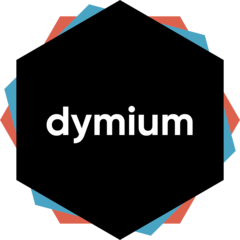

<!-- README.md is generated from README.Rmd. Please edit that file -->

```{r setup, include = FALSE}
knitr::opts_chunk$set(
  collapse = TRUE,
  comment = "#>",
  fig.path = "man/figures/README-",
  out.width = "100%"
)
```
<!-- badges: start -->
[](https://www.tidyverse.org/lifecycle/#experimental)
[](https://www.gnu.org/licenses/gpl-3.0)
[](https://CRAN.R-project.org/package=dymiumCore)
[](https://CRAN.R-project.org/package=dymiumCore)
[](https://travis-ci.org/dymium-org/dymiumCore)
[](https://codecov.io/gh/dymium-org/dymiumCore?branch=master)
<!-- badges: end -->

# dymiumCore: 

**dymiumCore** is an R package which provides a toolbox for developing a microsimulation
model that is modular and pipable. While the core focus of the package is for modelling
urban systems, dymium can be easily extended to apply in other contexts as well.

## Installation

The dymiumCore package has not been released on CRAN, but you can install from [GitHub](https://github.com/) with:

```{r eval = FALSE}
# install.packages("remotes")
remotes::install_github("dymium-org/dymiumCore")
```

## Tutorials

For tutorials please see the articles at [https://main.dymium.org](https://main.dymium.org).

## Available modules

Please visit [dymium-org/dymiumModules](https://github.com/dymium-org/dymiumModules) to see available modules.

## Overview

An implementation of a microsimulation model usually consists of these four 
components which are entities, rules, transition, and markets.

### Entities

Entities can be persons, firms, buildings, zones, transport network etc. They
can be conviniently defined as a class, based on the concept of 'objects' in 
object-oriented programming. Each entity is known by its fields and methods, 
what it represents and what it can do. A person may contains fields such as age, 
gender, marital status. A person give birth, leave parental home, etc.  While 
a household may have household size, household id, number of vehicles owned as
its fields. A household can relocate, have new members and etc.

### Rules

In a microsimulation model, entities are given rules for them to follow under 
different conditions. A rule can simply be an ifelse statement such as:

```
if age is greater than 16:
    can_marry 
else:
    cant_marry
```

or probabilistic such as a rate-based model or a classification model 
(binary logit model, multinomial logit model, hazard-based model, random forest, 
and artificial neural network) that takes attributes of the entities as the
input variables.

### Transition

Transition takes in a rule and entities then simulate the outcomes of the entities
given the provided rule. For probabilistic rules, Monte Carlo simulation will be performed
based on the probabilistic values from the rules.

### Market

In microsimulation, a market is where entities are directly interact with one another.
A market can be an abstraction of a real-estate bidding market, a mate matching market,
a labour market, etc.

## Currently supported models

Currently, dymiumCore we only support model objects fitted using the `caret` package
for Monte Carlo simulation.

| Package |     Class |                                     Model types |         status |
| ------: | --------: | ----------------------------------------------: | -------------: |
|   caret |   `train` |            classification and regression models |      supported |
|  mlogit |  `mlogit` |                        multinomial logit models | in-development |
|    mlr3 | `Learner` | classification, survival, and regression models |        planned |

__Note that__: rate-based models can be used for simulation as well. To use them,
you first need to import them as  a data.frame and a named list.

- If a `data.frame` is provided, it must contain a key column or keys columns and
must have a column named 'prob' that must be a numeric type with values within [0,1]
which represent probability values. Recently, models of type data.table have gained 
a new support where multiple choices can be simulated using a data.table object
as a model. The data.table object should contains matching variables and two extra
columns which are `probs`, a list column of numeric vectors, and `choices`, also 
a list column but contains character vectors.

- A named `list` can be used to represent choices, where names of the list are 
choices and values are their associated probabilities. 
